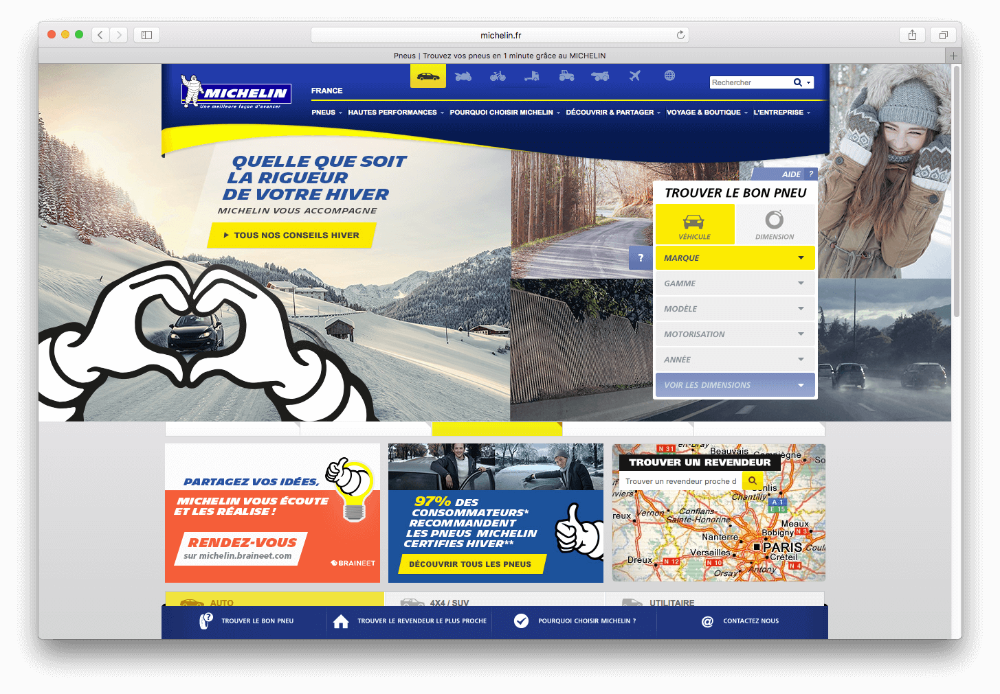
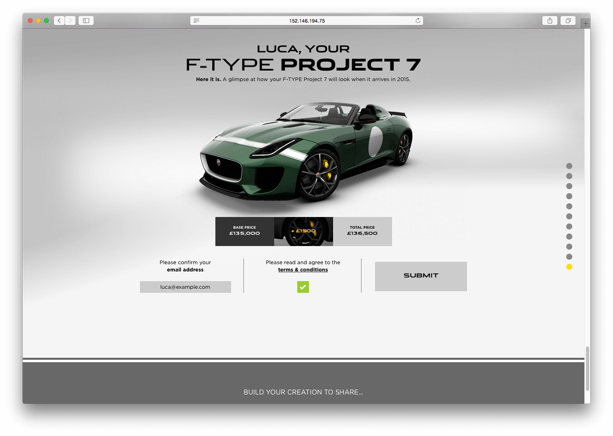
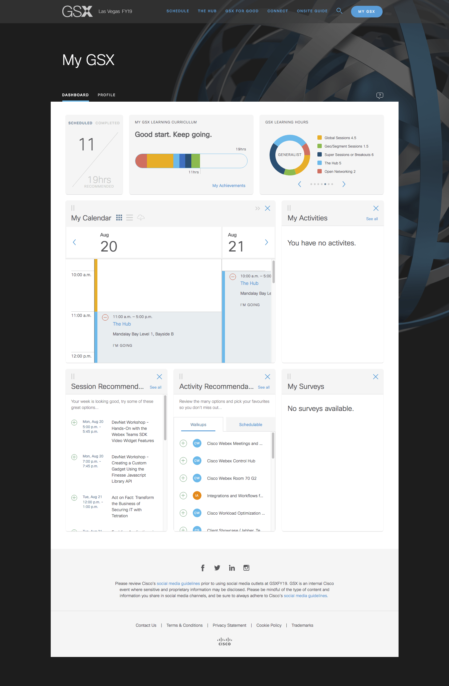

# time-capsule
To help future web relic hunters, looking for my work.

---

Sites/SPAs:
* [Skookum Festival](#skookum-festival)
* [Michelin platform and campaign sites](#michelin-platform-and-campaign-sites)
* [Qatar Airways](https://www.qatarairways.com/)
* [Jaguar F-TYPE Project 7](#jaguar-f-type-project-7)
* [The Equalizer - Sony Pictures](#the-equalizer---sony-pictures)

Web Apps:
* [UALA Business](#uala-business)
* [SAP](#sap)
* [Cisco GSX FY19](#cisco-gsx-fy19)
* [UALA Business](#uala-business)
* [Muse](#muse-collaboration-with-Microsoft-and-City-of-Vancouver)

## Skookum Festival

Festival main site for the 2018 edition.

Tech Stack: HTML5, CSS3, JavaScript, React.js, Redux, Styled Components, Node.js, Drupal, Docker

## Michelin platform and campaign sites

Previous version of the main Michelin platform and related campaign sites (Michelin Crossclimate as example)

Tech Stack: HTML5, CSS3/Sass, JavaScript/jQuery, Backbone.js, Java, Middleman, Greensock GSAP, Vagrant

## Jaguar F-TYPE Project 7

Password-protected website for prospective buyers of the Jaguar F-Type car.

Tech Stack: HTML5, CSS3/Sass, JavaScript/jQuery, Middleman

## The Equalizer - Sony Pictures

Campaign site for the movie "The Equalizer".

Tech Stack: HTML5, CSS3/Sass, JavaScript/jQuery, Middleman

## Uala Business

Web App for beauty salons and barber shops to manage their bookings, handle employees, show reports and more

Tech Stack: HTML5, JavaScript, React.js, Redux, Emotion, StoryBook, Styleguidist, Docker

## SAP

Mobile App (React Native) for the company's internal events management

Tech Stack: JavaScript, React Native, Redux, Styled Components, Node.js, Drupal

## Cisco GSX FY19

Web App for the company's GSX event

Tech Stack: JavaScript, React, Redux, Styled Components, Node.js, GraphQL

## Muse (collaboration with Microsoft and City of Vancouver)

Mobile App (React Native) to discover arts while walking downtown Vancouver

Tech Stack: JavaScript, React Native, Redux, Styled Components

